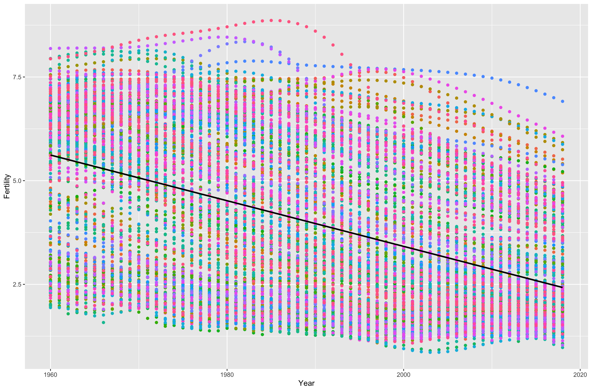
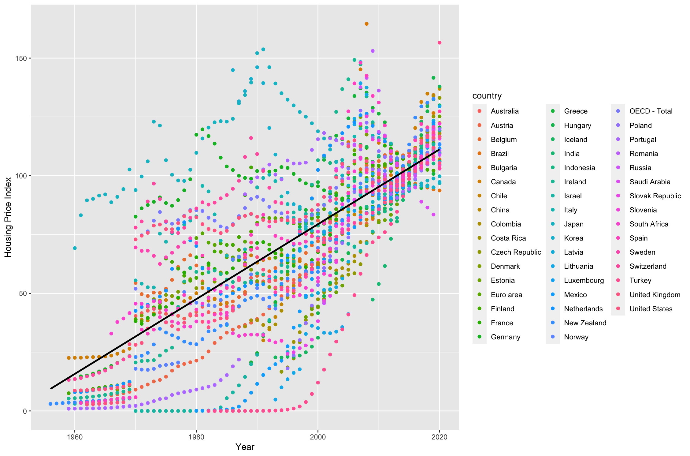
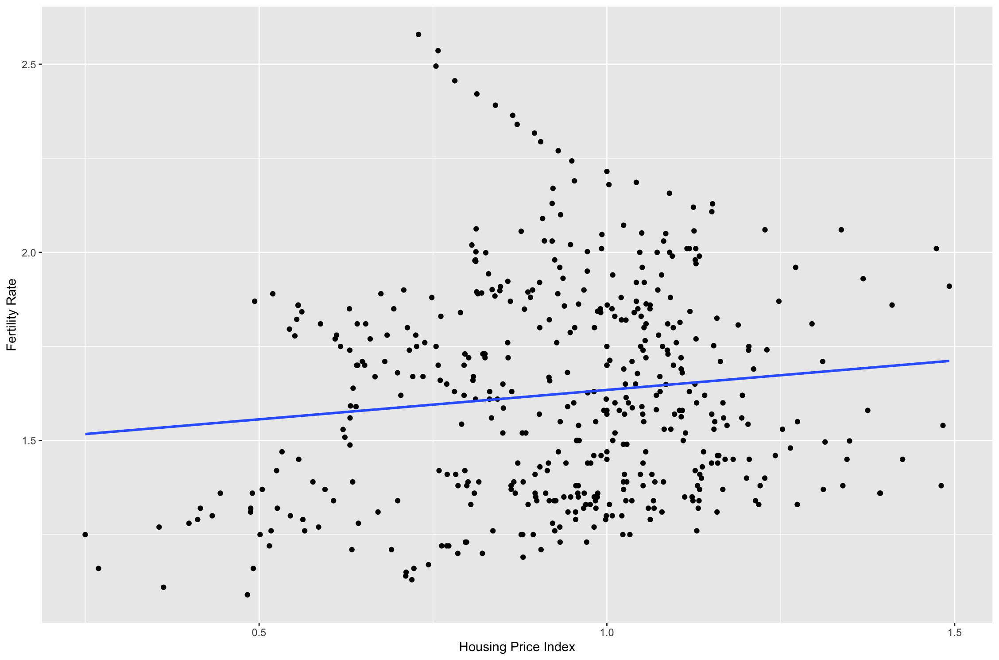

<style type = "text/css">

body{
  font-size: 16px;
  line-height: 1.5em;
}
code.r{
  font-size: 12px;
}
pre{
  font-size: 16px;
}
</style>

```{r setup, include = FALSE}
knitr::opts_chunk$set(echo = TRUE)
```

<br />
**<font size = 4>Our presentation video link: https://www.dropbox.com/s/e04cl4d76pjm0rb/5206Presentation.mov?dl=0</font>**

## Introduction: Why Fertility Rate?

Labor force has always been what economists stress the importance of due to the correlation between labor force and economic growth. This is demonstrated in the Solow-Swan model, which is known as a non-classical growth model (exogenous model). 
$$Y_t = K_t^\alpha(A_tL_t)^{1-\alpha}$$
where $t$ denotes time, $0 < \alpha < 1$ is the elasticity of output with respect to capital, and $Y_t$ represents total production. $A$ refers to labor-augmenting technology or “knowledge”, thus $AL$ represents effective labor.

Robert Solow and Trevor Swan (1956) tries to explain the economic growth by the capital, labor, and knowledge in the model, assuming that the technology level is exogenous and the same among countries. They conclude that the differences in long-run GDP growth rates per capita across countries represents the difference in capital accumulation, labor force and population.

Also, it is  the fertility rate that represents the speed of labor force generation. Therefore, the accumulation of labor force is closely related to fertility rate. However, in recent decades, the fertility rate has declined in many countries. Some developed countries’ fertility rates have fallen below the replacement rates like the United States, Korea, Japan and so on.

<br />
**<font size = 5>Fertility Rate All Over the world</font>**


This means that such countries face a lot of problems brought by the low fertility rate like the aging population, the growth of the economy. Therefore, we are interested in what is related to the fertility rate and make a recommendation to alleviate the problem that brought by declining fertility. 
In addition, the price of houses has increased dramatically over the past few decades especially in many countries. It is easy to see the upward trend from the global real house price index.

<br />
**<font size = 5>Housing Price Index</font>**


Some people argue that it is because of the increasing house price that lower the fertility rate. However, the plot below suggests a positive relationship. We would like to find out whether high housing price decreases fertility rate from a country-level dataset.

<br />
**<font size = 5>Fertility Rate v.s. Housing Price Index</font>**



## Data Description & Source

|Variable|Description                  |Source      |
|:-------|:-------------------------|:-----------|
|fer     |Fertility rate, total (births per woman)|World Bank  |
|gdp     |GDP                       |World Bank  |
|lab     |Labor force participation rate, female (% of female population ages 15+)|World Bank  |
|edu     |School enrollment, secondary, female (% gross)|World Bank  |
|cpi     |Consumer Price Index      |World Bank  |
|unemp   |Unemployment Rate         |World Bank  |
|pop     |Population                |World Bank  |
|hou     |Housing Price Index       |OECD        |
|ten     |Housing Tenure            |UN Data, American Housing Survey |
|sav     |Household Savings, % of household disposable income |OECD Data |
|asset   |Household Financial Assets, US dollars/capita |OECD Data |

* Data limitation: There exists many missing values. In order to get a panel data, missing values are dropped. Maybe imputing some missing values is another good choice. 

In order to analyze the potential causal effect between fertility rate and housing price, we try to handle the confounding factors of them. Here we combined two methods to achieve it. Firstly, fixed/random effect regression based on panel data can reduces the time-invariant confounding factors. Secondly, inspired by the study of Cevat Giray Aksoy (2016), we know that a main kind of confounders between fertility and housing price is personal/household wealth. So we try to involve some typical variables representing household wealth, like household financial assets and household savings. We would start with a ordinary linear regression. 

## Data Preparation

Import some packages and load data into our environment!

```{r, message = FALSE}
library(tidyverse)
library(readxl)
library(VIM)
library(imputeTS)
library(broom)
library(knitr)
library(olsrr)
library(MASS)
library(psych)
library(jtools)
library(boot)
library(plm)
fer <- read_csv("fertility.csv")
gdp <- read_excel("gdp.xls")
hou <- read_csv("house_price.csv")
lab <- read_csv("female_labor_force_participation.csv")
edu <- read_csv("school_enrollment_secondary.csv")
ten <- read_csv("house_tenure.csv")
cpi <- read_csv("cpi.csv")
unemp <- read_csv("unemployment.csv")
pop <- read_csv("population.csv")
asset <- read_csv("financial_asset.csv")
sav <- read_csv("household_saving.csv")
```

Do some data cleaning and combination!

```{r, message = FALSE}
fer <- fer %>%
  dplyr::select(-names(fer)[2:4]) %>%
  rename(country = `Country Name`)
fer <- fer %>%
  pivot_longer(names(fer)[-1], names_to = "year", values_to = "fer")
fer$year <- as.numeric(fer$year)

gdp <- gdp %>%
   dplyr::select(-names(gdp)[2:4]) %>%
  rename(country = `Country Name`)
gdp <- gdp %>%
  pivot_longer(names(gdp)[-1], names_to = "year", values_to = "gdp")
gdp$year <- as.numeric(gdp$year)

hou <- hou %>%
   dplyr::select(Country, Time, Value) %>%
  filter(str_length(Time) == 4) %>%
  rename(country = Country, year = Time, hou = Value) %>%
  group_by(country, year) %>%
  summarize(hou = mean(hou))
hou$year <- as.numeric(hou$year)

lab <- lab %>%
   dplyr::select(-names(lab)[2:4]) %>%
  rename(country = `Country Name`)
lab <- lab %>%
  pivot_longer(names(lab)[-1], names_to = "year", values_to = "lab")
lab$year <- as.numeric(lab$year)

edu <- edu %>%
   dplyr::select(-names(edu)[2:4]) %>%
  rename(country = `Country Name`)
edu <- edu %>%
  pivot_longer(names(edu)[-1], names_to = "year", values_to = "edu")
edu$year <- as.numeric(edu$year)

ten <- ten %>%
  filter(Area == "Total" & `Type of housing unit` == "Total") %>%
  rename(country = `Country or Area`, year = Year, tenure = Tenure, value = Value) %>%
   dplyr::select(country, year, tenure, value) %>%
  pivot_wider(names_from = tenure, values_from = value) %>%
  mutate(ten = `Member of household owns the housing unit` / Total) %>%
   dplyr::select(country, year, ten) %>%
  drop_na()

# add some data manually, which comes from new and small dataset/websites
ten <- ten %>% 
  add_row(country = "United States", year = 2019, ten = 79475/124135) %>%
  add_row(country = "United States", year = 2017, ten = 77567/121560) %>%
  add_row(country = "United States", year = 2015, ten = 74299/118290) %>%
  add_row(country = "United States", year = 2013, ten = 75650/115852) %>%
  add_row(country = "United States", year = 2011, ten = 76053/114833)
ten <- ten %>%
  group_by(country) %>%
  summarize(ten = mean(ten))

cpi <- cpi %>%
   dplyr::select(-names(cpi)[2:4]) %>%
  rename(country = `Country Name`)
cpi <- cpi %>%
  pivot_longer(names(cpi)[-1], names_to = "year", values_to = "cpi")
cpi$year <- as.numeric(cpi$year)

unemp <- unemp %>%
   dplyr::select(-names(unemp)[2:4]) %>%
  rename(country = `Country Name`)
unemp <- unemp %>%
  pivot_longer(names(unemp)[-1], names_to = "year", values_to = "unemp")
unemp$year <- as.numeric(unemp$year)

pop <- pop %>%
   dplyr::select(-names(pop)[2:4]) %>%
  rename(country = `Country Name`)
pop <- pop %>%
  pivot_longer(names(pop)[-1], names_to = "year", values_to = "pop")
pop$year <- as.numeric(pop$year)

fer_temp <- read_csv("fertility.csv")
fer_temp <- fer_temp %>%
  dplyr::select(`Country Name`, `Country Code`)
asset <- asset %>%
  filter(SUBJECT == "TOT") %>%
  rename(`Country Code` = LOCATION) %>%
  left_join(fer_temp) %>%
  rename(country = `Country Name`, year = TIME, asset = Value) %>%
  dplyr::select(country, year, asset)
sav <- sav %>%
  rename(`Country Code` = LOCATION) %>%
  left_join(fer_temp) %>%
  rename(country = `Country Name`, year = TIME, sav = Value) %>%
  dplyr::select(country, year, sav)
  
data_joined <- fer %>%
  inner_join(gdp) %>%
  inner_join(hou) %>%
  inner_join(lab) %>%
  inner_join(edu) %>%
  inner_join(cpi) %>%
  inner_join(unemp) %>%
  inner_join(pop) %>%
  inner_join(asset) %>%
  inner_join(sav) %>%
  left_join(ten) %>%
  drop_na()
data <- data_joined %>%
  mutate(gdp_per_log = log(gdp / pop), hou = hou/100, lab = lab/100, edu = edu/100, unemp = unemp/100, pop = log(pop), cpi = cpi/100, sav = sav / 100, asset = log(asset)) %>%
  dplyr::select(-gdp)
data_for_linear <- data %>%
  dplyr::select(-country, -year)
```

Before setting up our model, we rescaled some variables. We generate the GDP per capita using GDP/population because GDP per capita is one of the comparative indicators of economic performance, which can help us compare the  individual’s living standard in different countries. Then we take the log of the GDP per capita to make the range of GDP per capita smaller. The population is also logged. 
Also, to make all the predictors comparable to each other, we divide all the predictors by 100, since all the predictors previously all multiplied by 100 to remove the percentage sign. 

## A First Glance: Scatter Plot and Full Model

```{r, fig.width = 10, fig.height = 11}
pairs.panels(data_for_linear)
```

From the scatter plot, we'd expected that housing price has a negative relationship with fertility rate.

Let's look at the full linear regression model first.

```{r}
full <- lm(fer ~ ., data = data_for_linear)
summary(full)
```

Then let's do some simple assumptions test for the ordinary linear regresison model. 

## Diagnostics

### Assumptions of Linear Regressions

What can go wrong?

Our regression model require some assumptions:

Residuals should:

* be normally distributed.

* be independent.

* have the same variance.

* Basic idea of diagnostic measures: if model is correct then residuals $e_i = Y_i - \hat{Y_i}, 1\leq i \leq n$ should look like a sample of (not quite independent) $N(0,\sigma^2)$ random variables. 

Therefore, we are going to check all the assumptions. 

```{r}
par(mfrow = c(2,2))
plot(full, pch = 23, bg = 'orange', cex = 1)
```

From the plots above, the error follows a normal distribution and have constant variance. From Cook's distance, there are obviously some outliers. 

Since this a ordinary multiple regression without considering fixed/random effect, it may have many problems. 

## Fixed/Random Effect Regression based on Panel Data

Fixed/random effect regression model can assist in controlling for omitted variable bias due to unobserved heterogeneity when this heterogeneity is constant over time, which means it can help us reduce the time-invariant confounding factors. 

```{r}
fixed = plm(fer ~ hou + lab + edu + cpi + unemp + pop + asset + sav + ten + gdp_per_log, data = data, index = c("country", "year"), model = "within")
summary(fixed)
random = plm(fer ~ hou + lab + edu + cpi + unemp + pop + asset + sav + ten + gdp_per_log, data = data, index = c("country", "year"), model = "random")
summary(random)
```

Which is better, Fixed effect or random effect regression? Let's do a Hausman Test (set significance level as 0.05)

```{r}
phtest(fixed, random)
```
Since p-value < 0.05, we choose fixed effect model.

## Parameter Interpretation

The coefficient of housing price is `r round(fixed$coefficients['hou'], 2)`, which means, one unit increase in housing index would increase the fertility by 0.19. It is strongly against the opinion that a high housing price would decrease the fertility rate. In fact, according to some research, houses, as a kind of financial asset, has an investmental value. An increasing housing price can increase some persons’ wealth who already own houses, therefore strengthen their willing to have more children. Even for those who doesn’t own houses, expectation of continuous increasing of housing price may have the same effect.

Also, problems arises. If a country's housing price is already high enough, does the increasing in housing price still increases fertility rate? We may talk it through in the following parameter uncertainty part. 

## Parameter Uncertainty

### Parameters of High and Low House Pricing Groups

We divided the data into two groups by the median of house price to see how the coefficients change within different groups.

```{r}
data_low_hou <- data %>%
  filter(hou <= median(data$hou))
data_high_hou <- data %>%
  filter(hou > median(data$hou))
model_low_hou <- plm(fer ~ hou + lab + edu + cpi + unemp + pop + asset + sav + ten + gdp_per_log, data = data_low_hou, index = c("country", "year"), model = "within")
model_high_hou <- plm(fer ~ hou + lab + edu + cpi + unemp + pop + asset + sav + ten + gdp_per_log, data = data_high_hou, index = c("country", "year"), model = "within")
```

```{r, results = 'asis'}
export_summs(fixed, model_low_hou, model_high_hou, model.names = c("Full Data", "Low Housing Price Group", "High Housing Price Group"))
```

### Visualization of Coefficients

```{r}
plot_summs(fixed, model_low_hou, model_high_hou, scale = TRUE, robust = TRUE, inner_ci_level = 0.9, model.names = c("Full Data", "Low Housing Price Group", "High Housing Price Group"), coefs = "hou")
```

From the table and plot, we can see that in the low housing price group, the impact of housing price is much bigger while it is close to 0 in high housing price group. It is shown that when housing price is already high, it wouldn't stimulate people to have more children. The incentives almost disappear.

### Parameters of More and Less Financial Asset Groups

We divided the data into two groups by the median of household financial assets. 

```{r}
data_poor <- data %>%
  filter(asset <= median(data$asset))
data_rich <- data %>%
  filter(asset > median(data$asset))
model_poor <- plm(fer ~ hou + lab + edu + cpi + unemp + pop + asset + sav + ten + gdp_per_log, data = data_poor, index = c("country", "year"), model = "within")
model_rich <- plm(fer ~ hou + lab + edu + cpi + unemp + pop + asset + sav + ten + gdp_per_log, data = data_rich, index = c("country", "year"), model = "within")
```

```{r, results = 'asis'}
export_summs(fixed, model_poor, model_rich, model.names = c("Full Data", "Less Asset Group", "More Asset Group"))
```

### Visualization of Coefficients

```{r}
plot_summs(fixed, model_poor, model_rich, scale = TRUE, robust = TRUE, inner_ci_level = 0.9, model.names = c("Full Data", "Less Asset Group", "More Asset Group"), coefs = "hou")
```

From these two groups' results, we find those who already owns financial assets may be more stimulated. It is consistent with the guess above. 

## Limitations & Future Work

* Missing confounders of fertility rate and housing price.

* We may be missing terms. E.g. interaction terms, higher-order non-linear terms, polynomial terms. 

## Conclusion & Recommendation

All in all, as we demonstrated in our fixed effect regression model (even the ordinary linear regression model), we can conclude that even though the house price indeed has an impact on the fertility rate, high house prices do not lower the fertility rate as many people believe. 
Therefore, we recommend that policymakers should not try to lower the house price in order to stimulate people to have more children. Even though there are still unsolved limitations in this study like we illustrated previously, which needs future research, this study is to inform policy makers about the relationship between house prices and the fertility rate, so that the policy makers have a better understanding of this and make right decisions.
